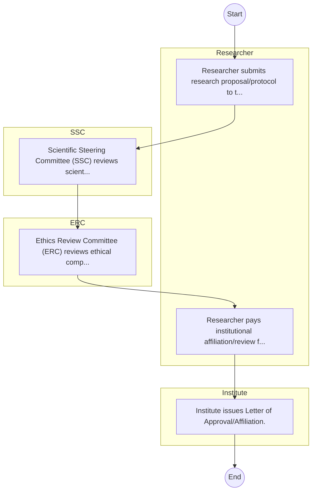

# Tourism Research Institute – Research Proposal Review

## Cover Page
- **Ministry/Department/Agency (MDA):** Tourism Research Institute
- **Process Name:** Research Proposal Review
- **Document Version:** 1.0
- **Date:** 2026-02-14
- **Classification:** Official

---

## Executive Summary
Represents 'General Economic and Commercial Affairs' cluster for balanced coverage; entity type: Agency. Included as Tier 3 for light‑touch desk review/survey.

---

## Process Flowchart (BPMN 2.0 - Mermaid)
*Guidance: This diagram visualizes the process flow across different actors (Swimlanes).*

---

## Process Overview
### Process Name
Research Proposal Review

### Service Category
- G2C/G2B

### Scope
- **In Scope:** End-to-end processing within Tourism Research Institute.

### Triggers
- Submission of application/request by Researcher.

### End States
- **Successful:** Admission Letter, Student ID Card, Academic Transcripts, Degree/Diploma Certificate

---

## Stakeholders
| Stakeholder | Role | Responsibilities |
|---|---|---|
| Researcher | Process Actor | Performs actions as defined in steps. |
| Institute | Process Actor | Performs actions as defined in steps. |
| SSC | Process Actor | Performs actions as defined in steps. |
| ERC | Process Actor | Performs actions as defined in steps. |

---

## Inputs & Outputs
- **Inputs:** KCSE/Academic Result Slips, National ID / Birth Certificate, Student Personal Details Form, Fee Payment Receipts
- **Outputs:** Admission Letter, Student ID Card, Academic Transcripts, Degree/Diploma Certificate

---

## Detailed Process (AS-IS)
| Step | Role | Action | Tool | Notes |
|---|---|---|---|---|
| 1 | Researcher | Researcher submits research proposal/protocol to the Institute. | Manual | |
| 2 | SSC | Scientific Steering Committee (SSC) reviews scientific merit. | Manual | |
| 3 | ERC | Ethics Review Committee (ERC) reviews ethical compliance. | Manual | |
| 4 | Researcher | Researcher pays institutional affiliation/review fees. | Manual | |
| 5 | Institute | Institute issues Letter of Approval/Affiliation. | Manual | |

---

## Pain Points & Opportunities
### Pain Points
- Long queues during admission and registration.
- Manual reconciliation of fee payments.
- Delays in processing exam results and transcripts.
- Fragmented student data across departments.

### Opportunities
- Biometric student registration and attendance.
- Integrated ERP for end-to-end student lifecycle management.
- Smart Campus Cards for access control and payments.
- E-learning and digital library integration.

---

## KPIs
| KPI | Baseline | Target |
|---|---|---|
| Turnaround Time | 30 Days | 5 Days |
| CSAT | 50% | 90% |
